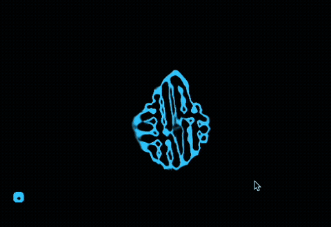

# Cellarium
*Note: This is a 100% vibe-coded experiment*

GPU-accelerated cellular automata in Rust. Write cell behavior in a subset of Rust; a proc macro cross-compiles it to WGSL shaders that run entirely on the GPU via wgpu.

<table cellspacing="0" cellpadding="0">
  <tr>
    <td></td>
    <td></td>
  </tr>
  <tr>
    <td></td>
    <td></td>
  </tr>
</table>

## Quick Start

```rust
use cellarium::prelude::*;

#[derive(CellState, Default)]
struct Life {
    alive: f32,
}

#[cell(neighborhood = moore)]
impl Cell for Life {
    fn init(x: f32, y: f32, w: f32, h: f32) -> Self {
        let hash = ((x * 12.9898 + y * 78.233).sin() * 43758.5453).fract();
        Self { alive: if hash > 0.6 { 1.0 } else { 0.0 } }
    }

    fn update(self, nb: Neighbors) -> Self {
        let n = nb.count(|c| c.alive > 0.5);
        let alive = if self.alive > 0.5 && (n == 2.0 || n == 3.0) {
            1.0
        } else if self.alive < 0.5 && n == 3.0 {
            1.0
        } else {
            0.0
        };
        Self { alive }
    }

    fn view(self) -> Color {
        if self.alive > 0.5 { Color::WHITE } else { Color::BLACK }
    }
}

fn main() {
    Simulation::<Life>::new(2048, 2048)
        .title("Game of Life")
        .run();
}
```

```
cargo run --example game_of_life
```

## How It Works

1. **`#[derive(CellState)]`** packs your struct fields into GPU textures (rgba32float, 4 channels each). Fields are never split across textures.
2. **`#[cell]`** compiles your `update`, `view`, and optional `init` methods into WGSL fragment shaders at compile time.
3. **`Simulation::run()`** opens a window and runs the simulation loop on the GPU — all cells update simultaneously each tick via double-buffered render passes.

All cells read from the same tick-N state and write to tick-N+1. No cell ever sees another cell's in-progress update.

## Defining Cell State

Field types: `f32` (1 channel), `Vec2` (2), `Vec3` (3), `Vec4` (4). Up to 8 textures (32 floats total).

```rust
#[derive(CellState, Default)]
struct MyCell {
    concentration: f32,   // tex0.r
    velocity: Vec2,       // tex0.gb
    phase: f32,           // tex0.a
    color: Vec3,          // tex1.rgb (didn't fit in tex0)
}
```

## Cell Behavior

The `#[cell]` attribute takes a neighborhood:

- `moore` — 8 adjacent cells
- `von_neumann` — 4 cardinal cells
- `radius(N)` — all cells within Chebyshev distance N

### Required Methods

**`update(self, nb: Neighbors) -> Self`** — the transition rule, called every tick. Access own state via `self.field`, neighbors via `nb.*` methods.

**`view(self) -> Color`** — maps state to an RGBA display color.

### Optional Methods

**`init(x: f32, y: f32, w: f32, h: f32) -> Self`** — programmatic initialization. Runs once on the GPU. `x`/`y` are grid coordinates, `w`/`h` are grid dimensions. If omitted, cells initialize from `Default`.

### Constants

Constants declared in the impl block become runtime-tunable parameters:

```rust
#[cell(neighborhood = moore)]
impl Cell for MyCell {
    const SPEED: f32 = 0.3;
    const DAMPING: f32 = 0.9999;
    // ...
}
```

These are adjustable live via the TUI or from saved JSON files (see [Runtime Controls](#runtime-controls)).

## Neighbors API

All neighbor operations take closures where `c` accesses a neighbor's fields:

### Aggregation

```rust
nb.sum(|c| c.field)          // Sum
nb.mean(|c| c.field)         // Average
nb.min(|c| c.field)          // Minimum (f32 only)
nb.max(|c| c.field)          // Maximum (f32 only)
nb.count(|c| c.field > 0.5)  // Count where true (returns f32)
```

### Filtered Aggregation

```rust
nb.sum_where(|c| c.value, |c| c.distance() < 5.0)
nb.mean_where(|c| c.value, |c| c.distance() <= INNER_R)
```

`mean_where` divides by the count of neighbors passing the filter, not the total neighborhood size.

### Differential Operators

```rust
nb.laplacian(|c| c.height)       // Discrete Laplacian (isotropic 9-point stencil)
nb.gradient(|c| c.pressure)      // Central differences -> Vec2
nb.divergence(|c| c.velocity)    // Divergence of a Vec2 field -> f32
```

### Spatial Accessors (inside closures)

```rust
c.distance()    // Euclidean distance to this neighbor (f32)
c.offset()      // Grid offset (dx, dy) as Vec2
c.direction()   // Normalized direction as Vec2
```

## Supported Rust Subset

The macro accepts a limited subset of Rust that maps cleanly to WGSL:

- **Arithmetic**: `+`, `-`, `*`, `/`, unary `-`
- **Comparison**: `==`, `!=`, `<`, `>`, `<=`, `>=`
- **Logic**: `&&`, `||`, `!`
- **Control flow**: `if`/`else` (both branches required, same type). No `match`, `loop`, `for`.
- **Let bindings**: `let x = expr;`
- **f32 methods**: `sin`, `cos`, `tan`, `sqrt`, `abs`, `floor`, `ceil`, `round`, `exp`, `ln`, `log2`, `fract`, `signum`, `powf`, `clamp`, `min`, `max`
- **Vector methods**: `length`, `normalize`, `dot`, `distance`, `cross` (Vec3)
- **Free functions**: `mix`, `step`, `smoothstep`, `atan2`, `vec2`, `vec3`, `vec4`
- **Color constructors**: `Color::rgb(r, g, b)`, `Color::rgba(r, g, b, a)`, `Color::hsv(h, s, v)`, `Color::WHITE`, `Color::BLACK`
- **Built-in values**: `tick`, `cell_x`, `cell_y`, `grid_width`, `grid_height`, `PI`, `TAU`

## Simulation API

```rust
Simulation::<MyCell>::new(1024, 1024)
    .title("My Simulation")
    .ticks_per_frame(8)       // simulation steps per rendered frame
    .paused(true)             // start paused
    .window_size(1920, 1080)  // explicit window size (default: maximized)
    .run();
```

## Runtime Controls

### Window

| Key | Action |
|-----|--------|
| `Space` | Pause / resume |
| `R` | Reset to initial state |
| `+` / `-` | Adjust ticks per frame |
| `Esc` | Quit |
| Scroll / pinch | Zoom |
| Click + drag | Pan |

### Parameter TUI

When a simulation has constants, a terminal UI launches automatically for live parameter tuning. The same keys work from both the simulation window and the TUI:

| Key | Action |
|-----|--------|
| `Up` / `Down` | Select parameter |
| `Left` / `Right` | Adjust selected parameter (x1.05) |
| `Shift` + `Left` / `Right` | Coarse adjust (x1.2) |
| `D` | Reset selected parameter to default |
| `S` | Save parameters to JSON |

### Parameter Files

Save with `S`, load by passing the JSON file as a CLI argument:

```
cargo run --example gray_scott -- my_params.json
```

Saved files include a full replay of every parameter change with tick numbers, so loading one reproduces the exact parameter trajectory from the start of the simulation.

## Full Example: Gray-Scott Reaction Diffusion

```rust
use cellarium::prelude::*;

#[derive(CellState)]
struct GrayScott {
    a: f32,
    b: f32,
}

impl Default for GrayScott {
    fn default() -> Self {
        Self { a: 1.0, b: 0.0 }
    }
}

#[cell(neighborhood = moore)]
impl Cell for GrayScott {
    const DA: f32 = 0.21;
    const DB: f32 = 0.105;
    const FEED: f32 = 0.026;
    const KILL: f32 = 0.052;

    fn init(x: f32, y: f32, w: f32, h: f32) -> Self {
        let h1 = ((x * 12.9898 + y * 78.233).sin() * 43758.5453).fract();
        let h2 = ((x * 63.7264 + y * 10.873).sin() * 43758.5453).fract();

        // Tile space into 60px patches, seed ~25% with a blob of chemical B
        let px = (x / 60.0).floor();
        let py = (y / 60.0).floor();
        let phash = ((px * 43.17 + py * 91.53).sin() * 43758.5453).fract();

        let lx = x - (px + 0.5) * 60.0;
        let ly = y - (py + 0.5) * 60.0;
        let dist = (lx * lx + ly * ly).sqrt();

        let seeded = if phash < 0.25 && dist < 10.0 { 1.0 } else { 0.0 };
        let noise = h2 * 0.01;

        Self {
            a: 1.0 - seeded * 0.5,
            b: seeded * (0.25 + h1 * 0.1) + noise,
        }
    }

    fn update(self, nb: Neighbors) -> Self {
        let lap_a = nb.laplacian(|c| c.a);
        let lap_b = nb.laplacian(|c| c.b);
        let reaction = self.a * self.b * self.b;
        Self {
            a: (self.a + DA * lap_a - reaction + FEED * (1.0 - self.a)).clamp(0.0, 1.0),
            b: (self.b + DB * lap_b + reaction - (KILL + FEED) * self.b).clamp(0.0, 1.0),
        }
    }

    fn view(self) -> Color {
        let b = self.b;
        let t = (b * 3.5).clamp(0.0, 1.0);
        Color::hsv(0.58 - t * 0.25, 0.5 + t * 0.4, 0.04 + t * 0.96)
    }
}

fn main() {
    Simulation::<GrayScott>::new(1024, 1024)
        .title("Gray-Scott Reaction Diffusion")
        .ticks_per_frame(32)
        .run();
}
```

This runs a two-chemical reaction-diffusion system in the turbulent regime — the patterns never converge, producing endlessly shifting spots and waves. The four constants (`DA`, `DB`, `FEED`, `KILL`) are tunable at runtime via the TUI.

## Examples

```
cargo run --example game_of_life
cargo run --example gray_scott
cargo run --example wave
cargo run --example lenia
cargo run --example smoothlife
cargo run --example brians_brain
cargo run --example wireworld
cargo run --example cyclic
cargo run --example predator_prey
cargo run --example rock_paper_scissors
cargo run --example erosion
cargo run --example sandpile
cargo run --example cascade
```

## License

Apache-2.0
